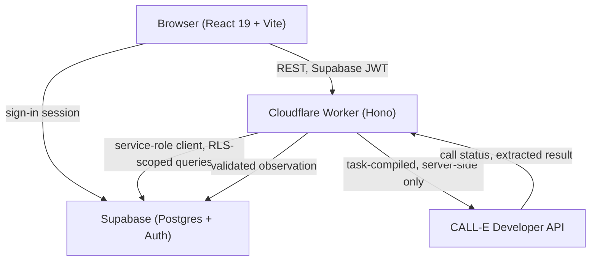

# Availary

A living availability timeline for childcare. Availary calls providers on your behalf, checks their answers against evidence in the transcript before trusting them, and keeps a dated history so an old waitlist reply never looks current again.

## What it does

- Build a care need once (age at start, desired start date, schedule) and shortlist providers.
- Availary places a single, disclosed phone call per check through [CALL-E](https://heycall-e.com), never more than one, never without your explicit approval.
- The provider's answer is validated against the call transcript before it's allowed to promote an "open now" or "expected opening" claim. Unverified claims fall back to unknown rather than guessing.
- Every check is timestamped and kept, so you can see a provider's availability change over time, not just its latest state.
- A public demo runs entirely on synthetic fixtures and can never place a real call.

## Architecture



The frontend never talks to CALL-E or holds its API key. It only ever knows about care needs, providers, and call runs through the Worker's REST surface, so the client's masked-phone, evidence-quote, and freshness rules can never be bypassed by a compromised or buggy browser.

See [`docs/ARCHITECTURE.md`](docs/ARCHITECTURE.md) for the call lifecycle, the evidence-validation rules, and the database schema.

## Stack

| Layer | Choice |
|---|---|
| Frontend | React 19, TypeScript, Vite, React Router |
| Backend | Cloudflare Worker, Hono |
| Data | Supabase Postgres with row-level security |
| Auth | Supabase Auth (Google OAuth, email magic link) |
| Calling | CALL-E Developer API, server-side only |
| Testing | Vitest, Testing Library |

## Local development

```bash
npm install
cp .env.example .env      # fill in your own Supabase project + CALL-E key
npm run dev                # frontend, http://localhost:5173
npm run worker:dev         # backend, http://localhost:8787
```

Without Supabase credentials configured, the app boots straight into fixture mode: every screen works, nothing is persisted, and no call can ever be placed. This is also what the deployed public demo runs on.

## Safety gates

- `AVAILARY_LIVE_CALLS` defaults to `false`, and that default must always be safe to leave in place.
- A live call requires an authenticated user, a previewed and explicitly approved call intent, and a phone number that passes `AVAILARY_DEMO_ALLOWLIST` when that allowlist is set.
- Every call intent carries a stable idempotency key. An ambiguous or lost response is reconciled, never retried as a fresh call.
- Raw call transcripts are used once to validate evidence, then discarded. Only the extracted, validated fields and evidence quotes are stored.

## Tests

```bash
npm run typecheck
npm test
```

## Deployment

Live at **[availary.timjosh507.workers.dev](https://availary.timjosh507.workers.dev)** — Cloudflare Worker, static assets served from the same origin. Live calls are off (`AVAILARY_LIVE_CALLS=false`); the deployed app runs the real backend but never dials.

## License

ISC
