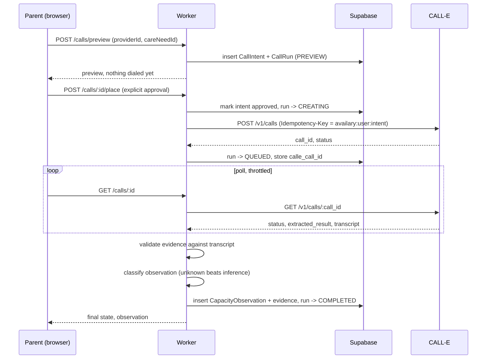

# Architecture

## Call lifecycle

A call is never placed as a side effect of loading a page. It takes an explicit preview, then an explicit approval, and every step in between is idempotent.

If the create request fails ambiguously (timeout, 5xx, 429), the Worker never mints a new idempotency key and never calls `POST /v1/calls` again for that intent. The run moves to `RECONCILE_REQUIRED` and the next poll resolves it from CALL-E's own state.

## Evidence validation

A CALL-E result is not trusted just because the call completed. Before an observation can be promoted to `OPEN_NOW` or `EXPECTED_OPENING`, its supporting evidence quote must appear as a contiguous substring of a recipient (`speaker: "user"`) transcript turn, after normalizing both to NFKC, lowercase, collapsed whitespace, and straight quotes. No fuzzy matching. A quote that isn't found means the claim falls back to `UNKNOWN` rather than being reported as fact. See `src/server/observations/validate-evidence.ts` and `classify.ts`.

Raw transcripts are used once, in that request, to run this check, and are never written to the database. Only the classified state, the evidence quotes, and whether each quote was verified are persisted.

## Pre-auth to signed-in handoff

The product lets someone build a care need and shortlist providers before creating an account (`/start`, `/providers` are public routes). That state lives in the browser (`src/services/localDraft.ts`) under client-generated UUIDs, not in Supabase. The first backend call after sign-in syncs the draft in one idempotent upsert (`POST /care-needs/sync-draft`), keyed by those same UUIDs, so nothing the user already navigated to breaks. The draft is only cleared once that sync succeeds; a failed sync leaves it in place to retry.

## Data model

`supabase/migrations/0001_init.sql` is the source of truth. Row-level security is enabled on every table; the Worker's service-role key bypasses it, but a compromised anon key cannot read or write another user's rows.

| Table | Holds |
|---|---|
| `care_needs` | One search: age at start, desired start date, schedule |
| `providers` | Encrypted phone (AES-GCM), masked last 4 digits, consent basis |
| `call_intents` | Idempotency key, preview snapshot, approval timestamp |
| `call_runs` | CALL-E call id, lifecycle status, failure diagnostics |
| `capacity_observations` | One timestamped, classified availability check |
| `observation_evidence` | The quote backing each classified field |
| `audit_events` | Append-only, anonymized on user deletion |

## Safety boundaries

- `AVAILARY_LIVE_CALLS=false` is the default everywhere and is safe to leave in place indefinitely.
- `AVAILARY_DEMO_ALLOWLIST` restricts which numbers can actually be dialed while live calls are on, for verification windows.
- `do_not_contact_at` on a provider blocks even creating a call preview, not just placing the call.
- The public `/demo` route is pinned to the fixture service adapter regardless of what backend the rest of the app is wired to, so it can never dial or read a real user's data.
